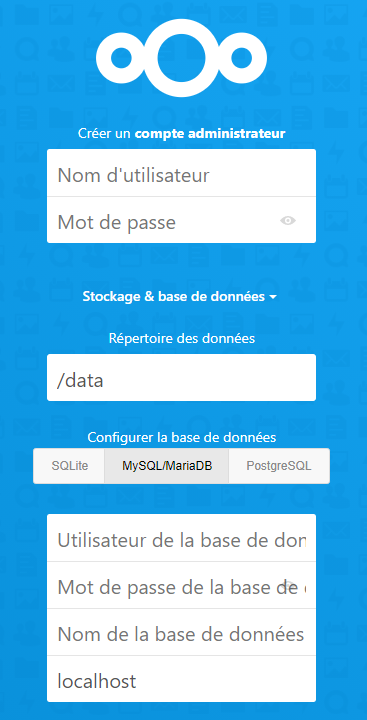

# Installation de Nextcloud via Docker  
  


  
  
## PREREQUIS

Installer Docker sur votre machine: 
https://docs.docker.com/engine/install/debian/

  
  
## ARBORESCENCE
Nous allons d'abord créer l'arborescence suivante qui nous servira pour 
l'installation.    

* RACINE 

    * NEXTCLOUD 
    
        * MARIADB 
    
        * CONFIG 
    
        * DATA 
    


  
  
## DOSSIERS DE TRAVAIL
On utilise donc les commandes ci-dessous:
* On créé le répertoire racine de notre projet  
`mkdir racine`
* On se place à l'intérieur de ce répertoire  
`cd racine`
* On créé le dossier de notre service nextcloud  
`mkdir nextcloud`
* On se positionne à l'interieur de ce dossier de service Nextcloud  
`cd nextcloud`
* On créé un sous-dossier pour la base de données mariadb  
`mkdir mariadb`
* On créé un sous-dossier pour la configuration Nextcloud  
`mkdir config`
* On créé un sous-dossier pour les données su service Nextcloud  
`mkdir data`
* On créé et on ouvre le fichier docker-compose.yml  
`sudo nano docker-compose.yml`

  
  
## DOCKER-COMPOSE.YML
Récupérer le fichier **docker-compose.yml** dans le dépôt avec un `git-clone https://github.com/liberops/Nextcloud.git`ou copier/coller le code ci-dessous sans votre fichier **docker-compose.yml** et effectuer les modifications pour le personnaliser.  
Penser à changer **MOTDEPASSE1** et **MOTDEPASSE2**  


 ```
version: "2"
services:
  nextcloud:
    image: linuxserver/nextcloud
    container_name: nextcloud
    environment:
      - PUID=1000
      - PGID=1000
      - TZ=Europe/Paris
    volumes:
      - /racine/nextcloud/config:/config
      - /racine/nextcloud/data:/data
    ports:
      - 443:443
    depends_on:
      - mariadb
    restart: unless-stopped
  mariadb:
    image: linuxserver/mariadb
    container_name: mariadb
    environment:
      - PUID=1000
      - PGID=1000
      - MYSQL_ROOT_PASSWORD=MOTDEPASS1
      - TZ=Europe/London
      - MYSQL_DATABASE=nextcloud
      - MYSQL_USER=nextcloud
      - MYSQL_PASSWORD=MOTDEPASS2
    volumes:
      - /racine/nextcloud/mariadb:/config
    restart: unless-stopped
```


    
On enregistre ce fichier **docker-compose.yml**  

On se replace dans le dossier NEXTCLOUD si ce n'était plus le cas  
`cd nextcloud`  

On lance le fichier **docker-compose.yml** avec la commande suivante:  
`docker-compose up -d`  

**Le résultat doit être DONE !!!!!**


  
  
## ACCES WEB
Ouvrez votre navigateur et taper l'adresse IP de la machine sur laquelle 
vous avez fait l'installation:  
`https:\\IPDELAMACHINE`   
Vous allez tomber sur l'interface de configuration de votre service 
Nextcloud


  
  
## FINALISATION
Sur cette page, vous allez créer un compte administrateur et un mot de 
passe



Vous allez devoir saisir les informations liées à votre configuration 
donc les informations personnalisées dans le **docker-compose.yml** 


                                               | 
    Le répertoire de données est:              | /data
    La base de données est:                    | MySQL/MariaDB
    Lutilisateur de la base de données est:    | nextcloud
    Le mot de passe de la base de données est: | MOTDEPASSE2
    Le nom de la base de données est:          | nextcloud
    localhost                                  | mariadb


Cliquez sur **Terminer la configuration**  

Votre service Nextcloud est en place avec des données persistantes sur votre machine et tournant avec 2 
conteneurs Docker linuxserver/nextcloud et linuxserver/mariadb
